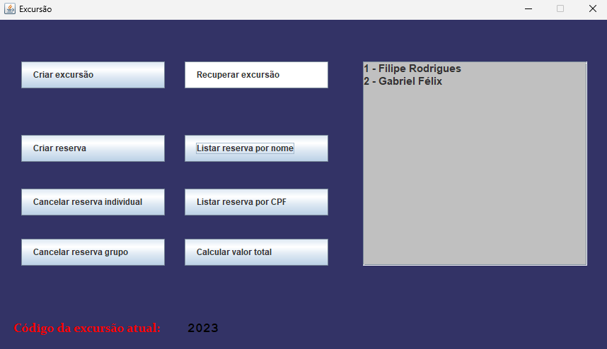

<h1 align="center">🗺️ Sistema de Excursões</h1>

  
  
  
  

   

 
    <h3>👾 Objetivo:</h3>
    
Construir um sistema de excursões que respeite as <a href="https://github.com/filipe-rds/Projeto1-POO/blob/main/assets/POO-projeto1-2023.2.pdf">regras de negócio</a> estabelecidas previamente para o projeto e que seja capaz de armazenar os dados obtidos em um banco de dados em forma de arquivo.

 
  <h3>💻 Devs:</h3>
  
   
  

